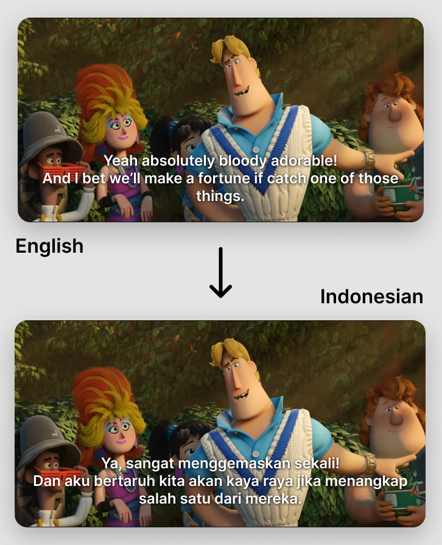

# video-caption-translator

A command-based AI-powered tool for translating video subtitles.



_Animation: [Sprite Fright](https://youtu.be/_cMxraX_5RE) by Blender Studio_

## Overview

`video-caption-translator` is a command-line tool build with bun and typescript. It reads subtitles from a video and translating the cues, and can output translated captions as standalone subtitle files or embed soft subtitles back into the video.

Using Ollama as your primary provider lets you easily use models both locally and in the cloud.

## Installation

> [!IMPORTANT]
>
> This project depends on `ffmpeg` and `ffprobe`. It is **HIGHLY RECOMMENDED** that you install these tools first.

For installation, go to [releases page](https://github.com/nomi-nonsz/video-caption-translator/releases) and download the executable binary based on your operating system.

### Automated Installation (Beta)

Linux/MacOS only.

```bash
curl -fsSL https://raw.githubusercontent.com/nomi-nonsz/video-caption-translator/refs/heads/main/install.sh | sh
```

## Usage

```bash
video-caption-translator --lang en --type video --model openai/gpt-5-mini mycontent.mkv -o mycontent-translated.mkv
```

Specify the options

```bash
video-caption-translator -l sp -t srt -s 20 -m ollama/gemma4 --tone casual --context-size 10 mycontent.mkv -o mycontent-translated.srt
```

List connected models

```bash
video-caption-translator --list-models
```

## Configuration

Configuration can be set via environment variables

On Linux/MacOS:

```bash
export OPENAI_API_KEY=<your-api-key>
```

Or Windows (powershell):

```powershell
$env:OPENAI_API_KEY=<your-api-key>
```

One command works too

```bash
ANTHROPIC_API_KEY=<your-api-key> video-caption-translator --lang en --type video --model anthropic/claude-opus-4-6 mycontent.mkv -o mycontent-translated.mkv
```

> [!TIP]
>
> Since it's built with Bun, it can automatically load the environment variables in the `.env` file right in your working directory.

## Docker 🐳

video-caption-translator is available as a container image to simplify deployment. You can pull this image from the GitHub Container Registry.

Here's an example of how to use it directly:

```bash
docker run -it --rm -v $PWD:/root -e OPENAI_API_KEY=<your-api-key> ghcr.io/nomi-nonsz/video-caption-translator:latest --lang en --type video --model openai/gpt-5-mini mycontent.mkv -o mycontent-translated.mkv
```

## Providers

Supported providers:

- Anthropic
- Groq
- Google
- LM Studio
- OpenAI
- xAI

```bash
export ANTHROPIC_API_KEY=<your-api-key>
export GROQ_API_KEY=<your-api-key>
export GOOGLE_API_KEY=<your-api-key>
export OPENAI_API_KEY=<your-api-key>
export XAI_API_KEY=<your-api-key>
export LM_API_TOKEN=<your-token>
```

## Local Ollama and LM Studio

To use Ollama and LM Studio locally, set the `OLLAMA_HOST` and `LM_HOST` with your local url

```bash
export OLLAMA_HOST="http://localhost:11434"
export LM_HOST="http://localhost:1234"
```

## Ollama Cloud

If you using ollama cloud

```bash
export OLLAMA_API_KEY=<your-api-key>
```

Third-party or self-hosted ollama:

```bash
export OLLAMA_HOST=https://ollama.example.com
```

## Available languages
- English (`en`)
- Arabic (`ar`)
- Chinese (`zh`)
- Dutch (`nl`)
- Finnish (`fi`)
- French (`fr`)
- German (`de`)
- Hindi (`hi`)
- Hungarian (`hu`)
- Indonesian (`id`)
- Japanese (`ja`)
- Korean (`ko`)
- Polish (`pl`)
- Portuguese (`pt`)
- Russian (`ru`)
- Spanish (`es`)
- Thai (`th`)
- Turkish (`tr`)
- Ukrainian (`uk`)
- Urdu (`ur`)
- Vietnamese (`vi`)

## Supported Formats

Video:
- Matroska `mkv`
- WebM `webm`
- MP4 `mp4` (limited)

Subtitles
- Subrip `srt`
- WebVTT `vtt`

## Contributing

Contributions, issues, and feature requests are welcome. Feel free to open a pull request or issue.

## License

This project is open source. Add your preferred license here.

